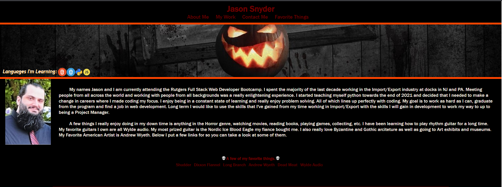
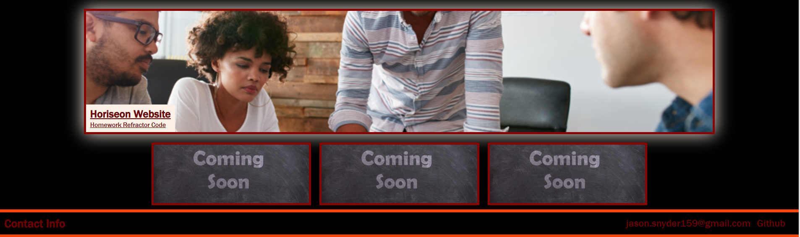

# Portfolio

[Portfolio Page](https://jsnyder159.github.io/Portfolio/) 

## Description
Task: Create a personal profile for potential employers to view.  They will want to see previous work when profile is loaded, my name, a recent photo or avatar, and links to the different sections on the page.  When they click on a navigation like the UI will scroll to that section.  When the UI scrolls to work there should the first application be titled, image larger in size than other work.  Once clicking on the image it should take you to the deployed website.  When the page is resized or viewed on various devices the layout is responsive and adapts to my viewport.

Steps Taken:

- HTML and CSS created from scratch of my personal profile.

- Image of myself added to the left of my bio section, Name added to top left of page.

- Links to the different sections of the page in upper right with hover change effects, and links that send the viewer to those sections upon click.

- When click on Work UI will scroll to my work section showing my first application (Horiseon refractor) larger with a title in the bottom left.  

- Horiseon work has a hover effect showing a glow around the box, upon clicking on the image it will send you to the github.io page associated with the work.

- Flex boxes and media queries were utilized to allow a responsive layout for different viewing devices.

- Additional stylized effects added to different navigation buttons and options taking you to different web pages of interest.

- alt tags provided for all images with meaningful descriptions.

- HTML and CSS code were cleaned up and best practices followed.

- Application loads with no errors.

- Github updates throughout working process with "commits" and containes current application code.

- Repository has a unique name, and follows best practices for file structure and naming conventions.

